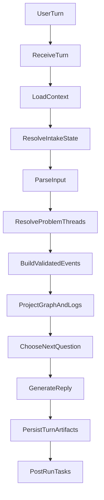
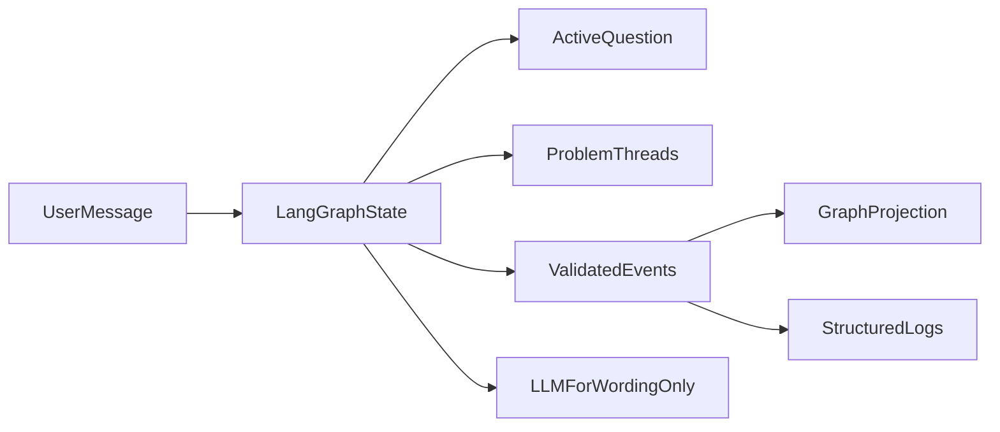
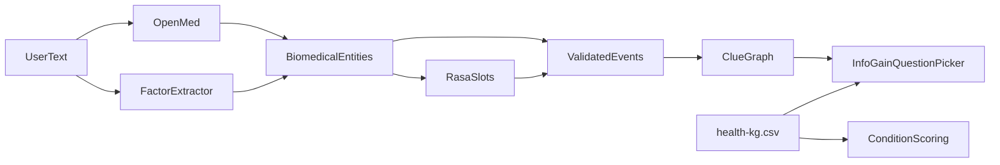
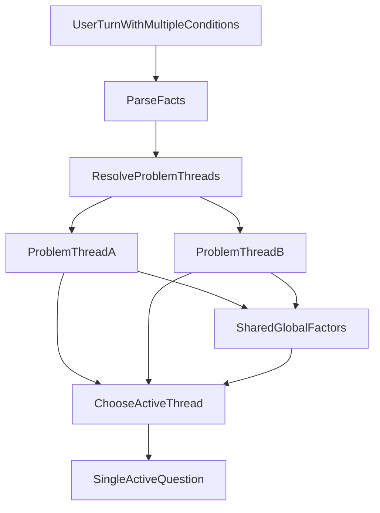
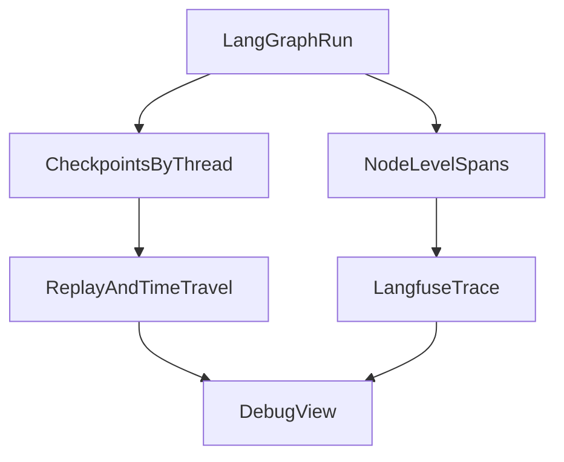

# LangGraph Agent Debug Architecture

## Purpose

This document turns the current Clue agent plan into a reference architecture for a LangGraph-based runtime with Langfuse tracing.

The goal is to make each user turn:

- explicit
- replayable
- checkpointed
- easy to debug

## Why This Exists

The current chat flow mixes multiple responsibilities inside one route:

- intake-state resolution
- extraction
- graph projection
- question selection
- reply generation
- post-response side effects

That makes it hard to answer basic debugging questions like:

- Which state was active for this turn?
- Why did the assistant ask this question?
- Which step failed?
- Did the graph update happen before or after the reply?
- Why did a numeric answer attach to the wrong context?

LangGraph should become the control plane that makes those steps visible.

## Core Decision

- `LangGraph` owns orchestration, checkpoints, replay, and state flow.
- `Langfuse` owns per-run tracing, span timelines, and execution metadata.
- The LLM is limited to wording and explanation after state is settled.

## Runtime Shape

## Ownership Rule

The critical rule is:

- `LangGraphState` is the only working memory for the turn.
- `ActiveQuestion` is resolved there, not in prompt text and not in graph nodes.
- `ValidatedEvents` are the source of truth for graph and log projection.
- The LLM does not decide state transitions.

## OSS Layer Alignment

These pieces should line up as separate layers, not competing control planes.

### Responsibility of each piece

- `web-app/data/health-kg.csv`
  Runtime OSS prior for deterministic condition scoring and missing-symptom lookup.

- `web-app/data/DerivedKnowledgeGraph_final.csv`
  Source or archival dataset only unless explicitly transformed into the runtime prior.

- `web-app/src/backend/lib/openmed/`
  Runtime biomedical extraction only.

- `rasa/`
  Runtime short-lived slot/session adapter only.

None of these should own orchestration. LangGraph sits above them.

## Multi-Condition Handling

The agent should treat a multi-condition answer as one turn that may update multiple problem threads, while still producing only one active structured question.

### Multi-condition rule

The runtime should explicitly model:

- `problemThreads[]`
- `activeProblemThreadId`
- `activeQuestion`
- `globalFactors`
- `validatedEvents[]`

Expected behavior:

1. Parse all symptom and condition mentions from the user turn.
2. Resolve them into one or more problem threads.
3. Attach global factors once, then reference them across threads as needed.
4. Build validated events per thread.
5. Choose exactly one active thread for the next structured intake question.
6. Let the reply acknowledge multiple problems, but ask only one canonical follow-up.

The product rule is:

- multi-condition input is allowed
- multi-question output is not

## Suggested LangGraph Nodes

### `ReceiveTurn`

Why this exists: Normalize request input and isolate the exact user turn being debugged.

### `LoadContext`

Why this exists: Fetch graph summary, memories, flare mode, intake state, and service health once.

### `ResolveIntakeState`

Why this exists: Make the authoritative active question and thread explicit before any LLM step.

### `ParseInput`

Why this exists: Run extraction and numeric-answer interpretation against the active question only while still collecting facts for multiple threads.

### `ResolveProblemThreads`

Why this exists: Convert one user turn into zero, one, or many condition/symptom threads without flattening them into a single state blob.

### `BuildValidatedEvents`

Why this exists: Convert resolved facts into stable event objects before graph projection, with thread context preserved.

### `ProjectGraphAndLogs`

Why this exists: Keep graph writes and structured log writes downstream of validated events.

### `ChooseNextQuestion`

Why this exists: Decide whether structured intake continues or exploratory questioning is allowed, and select one active thread for the next question.

### `GenerateReply`

Why this exists: Limit the LLM to wording after state has settled.

### `PersistTurnArtifacts`

Why this exists: Save messages, state deltas, touched row IDs, and trace metadata together.

### `PostRunTasks`

Why this exists: Keep clue generation and memory writes explicit instead of hidden fire-and-forget side effects.

## Tracing Model

### Tracing rule

Each LangGraph run should emit:

- one top-level trace per user turn
- one nested span per node

Minimum trace metadata:

- `userId`
- `conversationId`
- `threadId`
- `activeQuestionId`
- `problemThreadId`
- `runMode`

Minimum span payload:

- node name
- state-in summary
- state-out summary
- tool calls
- DB writes or RPCs
- touched evidence IDs or row IDs
- duration
- error status

This gives you:

- timeline debugging in Langfuse
- checkpoint replay in LangGraph
- correlation between one failing user turn and the exact node where state drift happened

## Migration Strategy

### Phase 1: Wrap current flow

Wrap the current route-driven flow in LangGraph nodes without rewriting the business logic yet.

Goal:

- visibility first
- stable checkpoints
- traceable node boundaries

### Phase 2: remove hidden state ownership

Move all active-question ownership into LangGraph state and eliminate prompt-era fallthrough behavior.

Goal:

- one owner of intake state
- one place where terse numeric answers resolve

### Phase 3: replay and regression

Use failing threads as fixtures for replay and compare:

- node path
- state deltas
- persisted events
- final reply

## Final Rule

LangGraph should become the single orchestration control plane for a turn.

That means:

- one authoritative state object
- one authoritative `problemThreads` list
- one explicit node path per turn
- one checkpointed thread history
- no hidden prompt-era state transitions outside the graph
