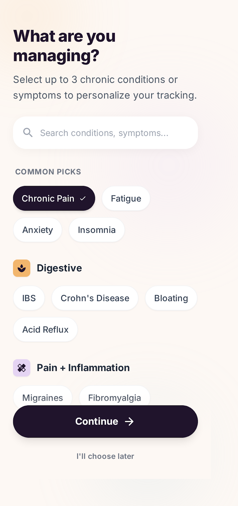
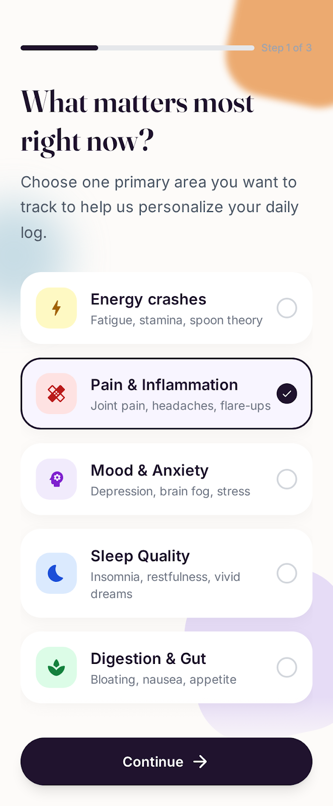
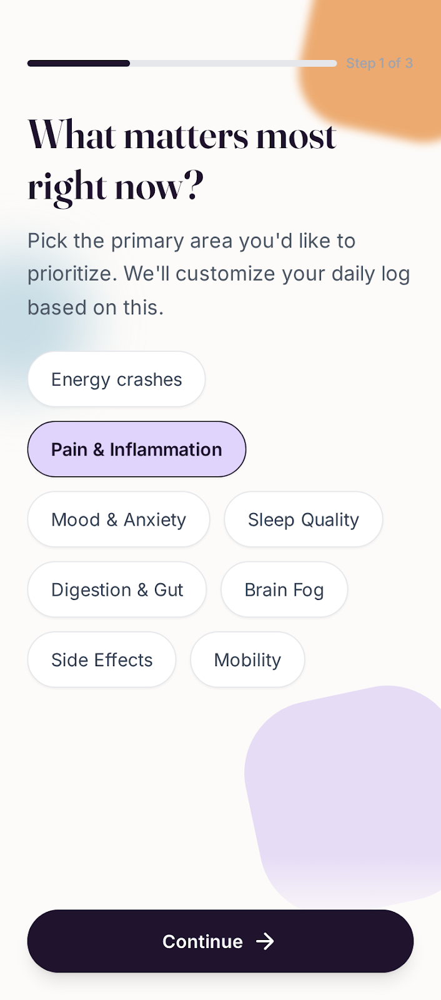
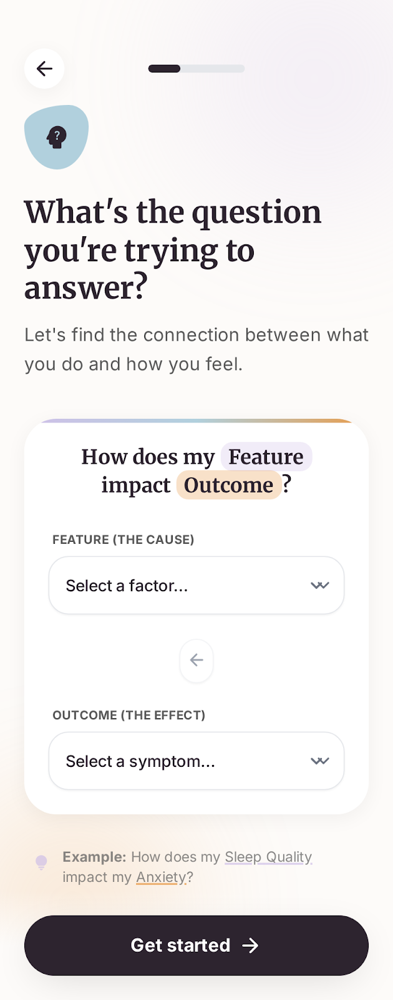
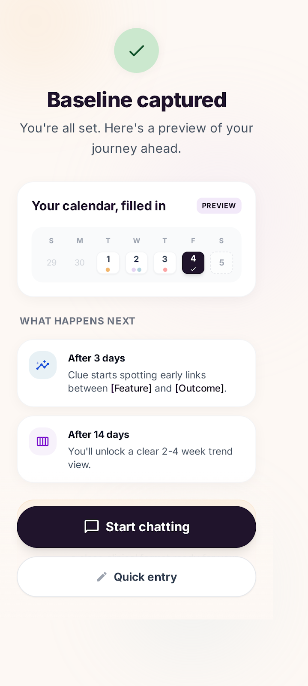
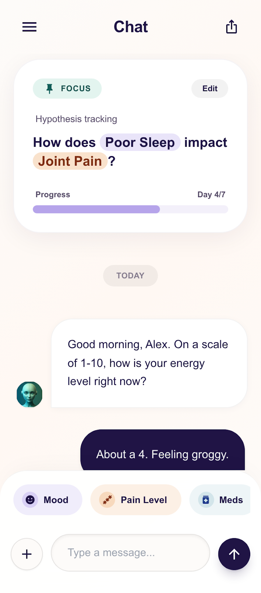

# Implementation Plan: Onboarding Flow

**Feature**: 1-onboarding-flow  
**Created**: 2025-12-28  
**Status**: Ready for Implementation  
**Estimated Effort**: 3-4 days (focused development)

---

## Pre-Implementation Checklist

- [ ] Review [`CLAUDE.md`](../../CLAUDE.md) for project conventions
- [ ] Review [`.claude-skills/frontend-design/SKILL.md`](../../.claude-skills/frontend-design/SKILL.md) for design system
- [ ] Verify Expo Go runs on both iOS and Android
- [ ] Ensure PowerSync dependencies are installed

---

## Phase 1: Foundation (Day 1 Morning)

### 1.1 Install Dependencies

```bash
# PowerSync + Supabase
pnpm add @powersync/react-native @powersync/kysely-driver @supabase/supabase-js

# Animations
pnpm add moti

# Fonts (Fraunces for display headings)
npx expo install @expo-google-fonts/fraunces
```

### 1.2 Update TypeScript Config

**File**: `tsconfig.json`

Add stricter rules for agent/data layer:
```json
{
  "compilerOptions": {
    "strict": true,
    "noUncheckedIndexedAccess": true,  // Catch evidence snapshot bugs
    "noImplicitReturns": true
  }
}
```

### 1.3 Create Design Tokens

**File**: `src/constants/design.ts`

```typescript
export const colors = {
  primary: '#20132E',
  primaryLight: '#f3f0fa',
  backgroundLight: '#FDFBF9',
  accentPeach: '#E8974F',
  accentBlue: '#A4C8D8',
  accentPurple: '#D0BDF4',
  textMuted: '#666666',
  inputBorder: '#E5E5E5',
  white: '#FFFFFF',
} as const;

export const spacing = {
  xs: 4,
  sm: 8,
  md: 16,
  lg: 24,
  xl: 32,
  xxl: 48,
} as const;
```

### 1.4 Create Onboarding Store

**File**: `src/lib/store/onboarding.ts`

Zustand store with MMKV persistence for:
- `step: number` (current onboarding step)
- `conditions: string[]` (max 3)
- `priority: string | null`
- `intent: 'awareness' | 'tracking' | 'insight' | 'action' | null`
- `impactQuestion: string | null`
- `baselineData: BaselineEntry[]`

---

## Phase 2: Shared Components (Day 1 Afternoon)

### 2.1 BackgroundBlobs Component

**File**: `src/components/onboarding/BackgroundBlobs.tsx`

**Reference**: All onboarding screens have these decorative blobs
- 

Features:
- Absolute positioned SVG/View blobs
- Peach blob (top-right area)
- Blue blob (bottom-left area)
- Purple blob (mid-right area)
- Use `opacity-30` for subtlety
- Moti entrance animation (fade + scale)

### 2.2 SelectionChip Component

**File**: `src/components/onboarding/SelectionChip.tsx`

**Reference**: 
- 
- 

Props:
```typescript
interface SelectionChipProps {
  label: string;
  emoji?: string;
  selected: boolean;
  disabled?: boolean;
  onPress: () => void;
  variant?: 'default' | 'with-description';
  description?: string;
}
```

Styles:
- Unselected: `bg-white border border-gray-200 rounded-full px-4 py-3`
- Selected: `bg-primary text-white rounded-full px-4 py-3`
- With emoji: Emoji on left, label on right
- Gentle press animation (Moti scale)

### 2.3 ProgressIndicator Component

**File**: `src/components/onboarding/ProgressIndicator.tsx`

**Reference**: Top of all onboarding screens

Props:
```typescript
interface ProgressIndicatorProps {
  currentStep: number;  // 1-6
  totalSteps: number;   // 6
}
```

Features:
- 6 dots in a row
- Active: filled circle (primary color)
- Completed: filled circle (accent-peach)
- Upcoming: outline circle (gray-300)
- Moti transition between states

### 2.4 StepContainer Component

**File**: `src/components/onboarding/StepContainer.tsx`

**Reference**: Layout wrapper for all onboarding screens

Features:
- `SafeAreaView` wrapper
- `BackgroundBlobs` included
- `ProgressIndicator` at top
- Scrollable content area
- Fixed bottom area for Continue button
- Keyboard-aware behavior

### 2.5 ContinueButton Component

**File**: `src/components/onboarding/ContinueButton.tsx`

Props:
```typescript
interface ContinueButtonProps {
  onPress: () => void;
  disabled?: boolean;
  label?: string;  // Default: "Continue"
}
```

Styles:
- Full width in container
- `bg-primary text-white rounded-full py-4`
- Disabled: `opacity-50`
- Press animation (subtle scale)

---

## Phase 3: Screen 1A - Conditions (Day 2 Morning)

**File**: `src/app/(onboarding)/conditions.tsx`

**Reference**: 
- Design: 
- Spec: [spec.md](./spec.md) User Story 1

### UI Elements

1. **Header**
   - "What are you managing?" (Fraunces, text-4xl)
   - "Select up to 3 conditions" (Inter, text-muted)

2. **Condition Chips** (multi-select, max 3)
   ```typescript
   const CONDITIONS = [
     { id: 'endometriosis', label: 'Endometriosis', emoji: '🩸' },
     { id: 'pcos', label: 'PCOS', emoji: '🔄' },
     { id: 'long-covid', label: 'Long COVID', emoji: '🦠' },
     { id: 'chronic-fatigue', label: 'Chronic Fatigue', emoji: '😴' },
     { id: 'fibromyalgia', label: 'Fibromyalgia', emoji: '💫' },
     { id: 'autoimmune', label: 'Autoimmune', emoji: '🛡️' },
     { id: 'migraine', label: 'Migraine', emoji: '🤕' },
     { id: 'mental-health', label: 'Mental Health', emoji: '🧠' },
     { id: 'other', label: 'Other', emoji: '➕' },
   ];
   ```

3. **Validation**
   - At least 1 condition required
   - Max 3 conditions
   - Show count: "2 of 3 selected"

4. **Navigation**
   - Continue → Screen 1B (priority)
   - Back → Exit onboarding (confirm dialog)

### Data Persistence
```typescript
// On Continue press
await saveOnboardingStep({
  step: 1,
  conditions: selectedConditions,
});
```

---

## Phase 4: Screen 1B - Priority (Day 2 Morning)

**File**: `src/app/(onboarding)/priority.tsx`

**Reference**: 
- Design: 
- Spec: [spec.md](./spec.md) User Story 2

### UI Elements

1. **Header**
   - "What matters most right now?" (Fraunces, text-4xl)
   - "Choose your primary focus" (Inter, text-muted)

2. **Priority Options** (single-select)
   - Reference: [README.md lines 140-172](../../README.md)
   
   ```typescript
   const PRIORITIES = [
     {
       id: 'reduce-pain',
       label: 'Reduce daily pain',
       description: 'Track triggers and find patterns',
     },
     {
       id: 'improve-energy',
       label: 'Improve energy levels',
       description: 'Understand what drains and restores you',
     },
     {
       id: 'better-sleep',
       label: 'Better sleep quality',
       description: 'Connect sleep to how you feel',
     },
     {
       id: 'manage-flares',
       label: 'Manage flare-ups',
       description: 'Predict and prepare for bad days',
     },
     {
       id: 'doctor-communication',
       label: 'Better doctor visits',
       description: 'Build evidence for appointments',
     },
   ];
   ```

3. **Chip Variant**
   - Use `variant="with-description"` for these
   - Larger touch target
   - Description text below label

### Data Persistence
```typescript
// On Continue press
await saveOnboardingStep({
  step: 2,
  priority: selectedPriority,
});
```

---

## Phase 5: Screen 1C - Intent Mode (Day 2 Afternoon)

**File**: `src/app/(onboarding)/intent.tsx`

**Reference**: 
- Design: Use  with Intent content
- Spec: [spec.md](./spec.md) User Story 3

### UI Elements

1. **Header**
   - "What would help you most?" (Fraunces, text-4xl)
   - "This helps Clue adapt to your needs" (Inter, text-muted)

2. **Intent Options** (single-select cards)
   - Reference: [README.md lines 140-172](../../README.md)
   
   ```typescript
   const INTENTS = [
     {
       id: 'awareness',
       title: 'Build Awareness',
       quote: '"I didn\'t realize how much my cycle affects my energy until I started tracking"',
       icon: '👁️',
     },
     {
       id: 'tracking',
       title: 'Track Consistently',
       quote: '"I finally have proof for my doctor that this isn\'t just in my head"',
       icon: '📊',
     },
     {
       id: 'insight',
       title: 'Find Patterns',
       quote: '"Clue helped me see that my migraines spike 2 days before my period"',
       icon: '🔍',
     },
     {
       id: 'action',
       title: 'Take Action',
       quote: '"Now I know to rest on day 21 because that\'s when fatigue hits"',
       icon: '⚡',
     },
   ];
   ```

3. **Card Design**
   - Full-width cards (not chips)
   - Icon + Title + Quote
   - Selected: border-primary, subtle background tint
   - Moti entrance stagger animation

### Data Persistence
```typescript
// On Continue press
await saveOnboardingStep({
  step: 3,
  intent: selectedIntent,
});
```

---

## Phase 6: Screen 2 - Impact Question (Day 2 Afternoon)

**File**: `src/app/(onboarding)/impact.tsx`

**Reference**: 
- Design:  (if exists)
- Spec: [spec.md](./spec.md) User Story 4

### UI Elements

1. **Header**
   - "Your first Impact Question" (Fraunces, text-4xl)
   - "Based on your focus: {priority}" (Inter, text-muted)

2. **Generated Question Display**
   - Large quote-style card
   - Question generated from intent + priority
   - Example: "What's ONE thing that would make today feel manageable?"

3. **Question Templates**
   ```typescript
   const IMPACT_QUESTIONS = {
     'reduce-pain': {
       awareness: "What does your body need most right now?",
       tracking: "On a scale of 1-10, how's your pain today?",
       insight: "Have you noticed any patterns with your pain recently?",
       action: "What's one thing you can do today to ease your discomfort?",
     },
     // ... other priority × intent combinations
   };
   ```

4. **Optional Customization**
   - "This doesn't feel right? Customize" link
   - Opens text input for custom question

### Data Persistence
```typescript
// On Continue press
await saveOnboardingStep({
  step: 4,
  impactQuestion: selectedOrCustomQuestion,
});
```

---

## Phase 7: Screen 3 - Baseline Capture (Day 3 Morning)

**File**: `src/app/(onboarding)/baseline.tsx`

**Reference**: 
- Design: 
- Spec: [spec.md](./spec.md) User Story 5

### UI Elements

1. **Header**
   - "Let's capture your baseline" (Fraunces, text-4xl)
   - "How are you feeling right now?" (Inter, text-muted)

2. **Widget-Based Entry**
   - Energy slider (1-10)
   - Pain slider (0-10)
   - Mood selector (5 emoji options)
   - Optional: free-text note

3. **Widget Components**
   ```typescript
   // src/components/widgets/
   ├── EnergySlider.tsx
   ├── PainSlider.tsx
   ├── MoodSelector.tsx
   └── NoteInput.tsx
   ```

4. **Intake Agent Activation**
   - On "Save baseline" press
   - Run intake normalization
   - Write to `episodes` + `episode_fields` tables

### Data Persistence
```typescript
// On Save press - THIS IS THE FIRST AGENT ACTIVATION
await saveBaseline({
  energy: energyValue,
  pain: painValue,
  mood: moodValue,
  note: noteText,
});

// Intake agent processes this:
await intakeAgent.normalize({
  type: 'baseline',
  data: baselineData,
});
```

---

## Phase 8: Screen 4 - First Chat (Day 3 Afternoon)

**File**: `src/app/(onboarding)/first-chat.tsx`

**Reference**: 
- Design: 
- Spec: [spec.md](./spec.md) User Story 6

### UI Elements

1. **Chat Interface**
   - Bot message bubble (left, light background)
   - User message bubble (right, primary color)
   - Typing indicator animation

2. **First Message (Template-Based)**
   ```typescript
   // Generated from onboarding context, NO LLM call
   const firstMessage = generateFirstMessage({
     conditions: userConditions,
     priority: userPriority,
     intent: userIntent,
     baseline: userBaseline,
   });
   ```

3. **Message Input**
   - Full-width input at bottom
   - Send button (arrow icon)
   - Suggestion pills above input:
     - "Tell me about my patterns"
     - "What should I track today?"
     - "I'm having a rough day"

4. **Navigation Hint**
   - Top-right corner: tab icons (History, Quick Entry, Analytics)
   - Tapping any → shows "Coming soon" or navigates to placeholder

### Agent Integration
```typescript
// When user sends first message:
const response = await chatAgent.respond({
  message: userMessage,
  context: {
    conditions: userConditions,
    baseline: userBaseline,
    recentEpisodes: [], // Empty for new user
  },
});
```

---

## Phase 9: Navigation & Routing (Day 3 Afternoon)

### Onboarding Layout

**File**: `src/app/(onboarding)/_layout.tsx`

```typescript
export default function OnboardingLayout() {
  return (
    <Stack
      screenOptions={{
        headerShown: false,
        animation: 'slide_from_right',
        gestureEnabled: false, // Prevent swipe back
      }}
    >
      <Stack.Screen name="conditions" />
      <Stack.Screen name="priority" />
      <Stack.Screen name="intent" />
      <Stack.Screen name="impact" />
      <Stack.Screen name="baseline" />
      <Stack.Screen name="first-chat" />
    </Stack>
  );
}
```

### Root Layout Update

**File**: `src/app/_layout.tsx`

```typescript
// Check onboarding completion
const { isOnboardingComplete } = useOnboardingStore();

// Route accordingly
<Stack>
  {!isOnboardingComplete ? (
    <Stack.Screen name="(onboarding)" />
  ) : (
    <Stack.Screen name="(tabs)" />
  )}
</Stack>
```

### Tabs Layout (Placeholder)

**File**: `src/app/(tabs)/_layout.tsx`

```typescript
// Minimal tabs for now, chat is primary
export default function TabsLayout() {
  return (
    <Tabs>
      <Tabs.Screen name="chat" options={{ title: 'Chat' }} />
      <Tabs.Screen name="history" options={{ title: 'History' }} />
      <Tabs.Screen name="quick-entry" options={{ title: 'Quick Entry' }} />
      <Tabs.Screen name="analytics" options={{ title: 'Analytics' }} />
    </Tabs>
  );
}
```

---

## Phase 10: Database Schema (Day 4 Morning)

### PowerSync Schema

**File**: `src/lib/db/schema.ts`

```typescript
export const schema = new Schema([
  // User onboarding data
  new Table({
    name: 'user_profile',
    columns: [
      new Column({ name: 'id', type: ColumnType.TEXT }),
      new Column({ name: 'conditions', type: ColumnType.TEXT }), // JSON array
      new Column({ name: 'priority', type: ColumnType.TEXT }),
      new Column({ name: 'intent', type: ColumnType.TEXT }),
      new Column({ name: 'impact_question', type: ColumnType.TEXT }),
      new Column({ name: 'onboarding_completed_at', type: ColumnType.INTEGER }),
      new Column({ name: 'created_at', type: ColumnType.INTEGER }),
      new Column({ name: 'updated_at', type: ColumnType.INTEGER }),
    ],
  }),
  
  // Episodes (check-ins, baseline, etc.)
  new Table({
    name: 'episodes',
    columns: [
      new Column({ name: 'id', type: ColumnType.TEXT }),
      new Column({ name: 'user_id', type: ColumnType.TEXT }),
      new Column({ name: 'type', type: ColumnType.TEXT }), // 'baseline', 'check-in', 'flare', 'chat'
      new Column({ name: 'timestamp', type: ColumnType.INTEGER }),
      new Column({ name: 'raw_input', type: ColumnType.TEXT }), // Original user input
      new Column({ name: 'created_at', type: ColumnType.INTEGER }),
    ],
  }),
  
  // Structured fields from episodes
  new Table({
    name: 'episode_fields',
    columns: [
      new Column({ name: 'id', type: ColumnType.TEXT }),
      new Column({ name: 'episode_id', type: ColumnType.TEXT }),
      new Column({ name: 'field_name', type: ColumnType.TEXT }), // 'energy', 'pain', 'mood', etc.
      new Column({ name: 'field_value', type: ColumnType.TEXT }),
      new Column({ name: 'confidence', type: ColumnType.REAL }), // For agent-extracted fields
      new Column({ name: 'source', type: ColumnType.TEXT }), // 'widget', 'agent', 'user'
    ],
  }),
  
  // Chat messages
  new Table({
    name: 'messages',
    columns: [
      new Column({ name: 'id', type: ColumnType.TEXT }),
      new Column({ name: 'user_id', type: ColumnType.TEXT }),
      new Column({ name: 'role', type: ColumnType.TEXT }), // 'user', 'assistant'
      new Column({ name: 'content', type: ColumnType.TEXT }),
      new Column({ name: 'evidence_snapshot', type: ColumnType.TEXT }), // JSON: { query_id, row_ids }
      new Column({ name: 'created_at', type: ColumnType.INTEGER }),
    ],
  }),
]);
```

---

## Phase 11: Testing (Day 4 Afternoon)

### Maestro E2E Flow

**File**: `.maestro/onboarding-flow.yaml`

```yaml
appId: com.clue.symptomtracker
---
- launchApp
- assertVisible: "What are you managing?"
- tapOn: "Endometriosis"
- tapOn: "Long COVID"
- tapOn: "Continue"
- assertVisible: "What matters most right now?"
- tapOn: "Reduce daily pain"
- tapOn: "Continue"
- assertVisible: "What would help you most?"
- tapOn: "Find Patterns"
- tapOn: "Continue"
- assertVisible: "Your first Impact Question"
- tapOn: "Continue"
- assertVisible: "Let's capture your baseline"
- tapOn:
    id: "energy-slider"
- tapOn: "Save baseline"
- assertVisible: "I see you're managing"
```

### Jest Unit Tests

**File**: `src/lib/agent/__tests__/templates.test.ts`

```typescript
describe('generateFirstMessage', () => {
  it('generates personalized message from onboarding context', () => {
    const message = generateFirstMessage({
      conditions: ['endometriosis', 'chronic-fatigue'],
      priority: 'reduce-pain',
      intent: 'insight',
      baseline: { energy: 4, pain: 6, mood: 'neutral' },
    });
    
    expect(message).toContain('endometriosis');
    expect(message).toContain('pain');
    expect(message).not.toContain('[object Object]');
  });
});
```

---

## Definition of Done

- [ ] All 6 onboarding screens implemented and navigable
- [ ] Designs match reference images (pixel-perfect)
- [ ] Data persists per-screen to MMKV + SQLite
- [ ] First message is template-generated (no LLM call)
- [ ] Baseline triggers intake agent normalization
- [ ] Works on iOS simulator + Android emulator
- [ ] Maestro E2E test passes
- [ ] No TypeScript errors
- [ ] No ESLint warnings

---

## Risk Mitigation

| Risk | Mitigation |
|------|------------|
| PowerSync setup complexity | Start with MMKV only, add PowerSync after core flow works |
| Font loading issues | Use system fonts initially, add Fraunces in polish phase |
| Android keyboard issues | Use KeyboardAvoidingView + test early |
| Animation jank | Keep animations simple, add complexity later |

---

## References

- [Constitution](../../.specify/memory/constitution.md)
- [Design System](../../.claude-skills/frontend-design/SKILL.md)
- [Feature Spec](./spec.md)
- [Agent Architecture](../../context/Agent-Architecture-Technical.md)
- [PowerSync Docs](../../powersync-llm-index.md)

